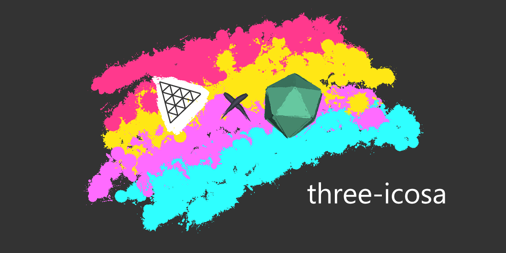

# three-icosa - Open Brush / Tilt Brush glTF Extensions for three.js

[](https://www.npmjs.com/package/three-icosa)
[](https://opencollective.com/icosa)
[](https://twitter.com/IcosaGallery)
[](https://discord.gg/W7NCEYnEfy)



`three-icosa` provides glTF extensions for [three.js](https://threejs.org) that allow for the correct rendering and animation of glTFs exported from [Open Brush](https://openbrush.app) and the now-discontinued Tilt Brush.

Specific extensions are required due to the shaders used to render Open Brush's unique brushes. These are currently implemented under the `GOOGLE_tilt_brush_material` extension originally written by Google.

This repository will also be home to extensions written by the Open Brush team for future brush enhancements, such as user-created brushes.

## Get
```
npm install --save three-icosa
```

You will also need a copy of the `brushes` directory from this repository. It is not distributed with this package through `npm` to save space. A GitHub hosted copy is available at the path: `https://icosa-gallery.github.io/three-icosa-template/brushes/`.
## Usage

Adding a new glTF extension is simple. our `GLTFGoogleTiltBrushMaterialExtension` only requires a path to a `brushes` directory (see above).

```js
import { GLTFGoogleTiltBrushMaterialExtension } from './three-icosa.module.js';

...

const scene = new Scene();
const gltfLoader = new GLTFLoader();

gltfLoader.register(parser => new GLTFGoogleTiltBrushMaterialExtension(parser, 'path/to/brush/folder/'));

gltfLoader.load('your_creation.glb' (model) => {
    scene.add(model.scene);
});
```

After registering the extension, it will automatically replace any detected Open Brush brushes.

## Limitations
Currently, the model will respond to the main directional light color for shading. However, the angle of the light is incorrect. We hope to have this fixed shortly.